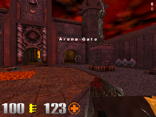
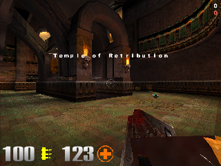
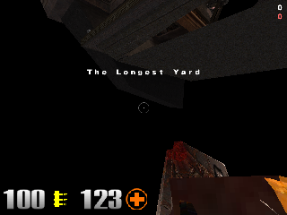
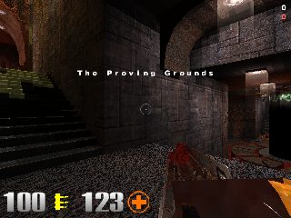
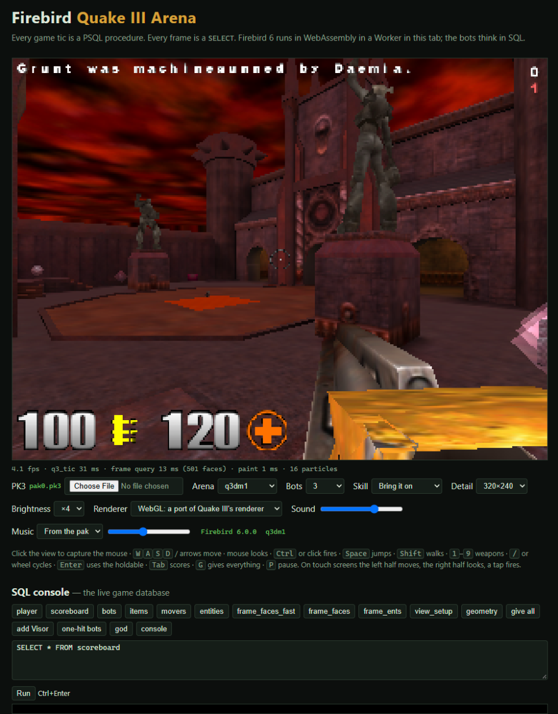

# Firebird Quake III Arena

 
 

Quake III Arena, simulated and rendered inside the [Firebird](https://firebirdsql.org) SQL database,
running entirely in your browser on Firebird 6 compiled to WebAssembly. The third of the series, after
[Firebird Quake 2](https://github.com/mariuz/firebird-quake2) and
[Firebird Quake](https://github.com/mariuz/firebird-quake), which grew out of
[Firebird DOOM](https://github.com/mariuz/firebird-doom).

Every game tic is a PSQL procedure call. Every frame is a `SELECT`. JavaScript handles the keyboard,
the mouse and the canvas; everything else — collision against the BSP's brushes and the Bézier patches'
facets, the player's physics, doors, plats, bobbing platforms, jump pads and teleporters, the items and
their respawns, the nine weapons, damage, the bots' deathmatch AI, the frag count and the announcer, and
the visibility of every polygon on screen — happens in SQL.

```
keyboard/mouse → SELECT * FROM q3_tic(...)        game logic: 20 Hz, PSQL
               → SELECT * FROM frame_all(...)      the frame, in one result set: the visible faces
                                                   (or every vertex projected, with texture and lightmap
                                                   coordinates), the MD3 entities and player models in the
                                                   PVS with their pose and animations, what to play and where
               → JS rasterises polygons, patches and models → canvas
```

**Play it at [mariuz.github.io/firebird-quake3](https://mariuz.github.io/firebird-quake3/)** — the page downloads the demo pak, starts Firebird 6 in a Worker and drops you into the Arena Gate with three bots.



## Running it

```bash
npm install
npm run fetch-pak      # downloads the Quake III Arena demo (linuxq3ademo-1.11-6.x86.gz.sh) and extracts demoq3/pak0.pk3
npm test               # SQL smoke test in Node against the real Firebird WASM engine: the Arena Gate
npm run test:dm7       # the same on the Temple of Retribution
npm run test:bots      # the bots: they see, chase, shoot, pick things up, die and respawn; the score keeps up
npm run serve          # http://localhost:8080/ — add -- --coi if your browser blocks service workers
npm run screenshots    # headless frames to docs/ (node scripts/screenshot.mjs q3dm1 --at=x,y,z,yaw --bright=4)
npm run bench          # where a tic and a frame spend their time
npm run bench:tic      # the cost of a tic over 200 tics of play (median, p90); add --walk, --bots=N
npm run inspect        # what is in the pk3 (maps, shaders, models, sounds); inspect map q3dm1, model …, shader …
```

If you own Quake III Arena, point the page at your own `pak0.pk3` with the file picker, or copy it with
`PAK=/path/to/pak0.pk3 npm run fetch-pak`: the full game's arenas, player models and the grenade launcher
and BFG work the same way. The demo has four arenas: q3dm1, q3dm7, q3dm17 and q3tourney2.

Firebird WASM uses pthreads, so the page must be cross-origin isolated. The dev server sends the
COOP/COEP headers with `--coi`; a static host like GitHub Pages cannot, so `coi-serviceworker.js`
re-issues responses with the headers after a one-time reload.

## How it works

The short tour follows; [docs/ARCHITECTURE.md](docs/ARCHITECTURE.md) is the long one, table by table
and procedure by procedure, and [docs/ROADMAP.md](docs/ROADMAP.md) lists what the real Quake III engine
has that this port does not, in the order a player feels it.

### The BSP becomes tables (`sql/schema.sql`, `src/bsp.js`, `src/loader.js`)

A Quake III BSP (IBSP version 46) is a relational database in disguise, and more so than Quake 2's:
`bsp.js` parses it and `loader.js` copies it in, denormalised so the hot loops never need a second lookup:

| table | from |
|---|---|
| `faces` | FACES with the plane (polygons) or a two-sided flag (patches, meshes), the shader's SURF_* flags, and a bounding sphere |
| `face_verts` | each face's vertices with texture and lightmap coordinates: polygons in order, patches and meshes as triangle lists |
| `nodes` | NODES with their plane copied in (children < 0 are leaves) |
| `leaves` | LEAFS with their cluster and area, the union of their brushes' contents, and the cluster's PVS as a hex string |
| `leaffaces`, `leafbrushes` | the leaf → face and leaf → brush index arrays |
| `brushes`, `brushsides` | the collision volumes: contents, and each side's plane and surface flags — plus one-sided facets for every cell of every Bézier patch |
| `models` | the world, its brush models (`*N`, each with a leaf of its own listing its brushes), every `.md3`, the sprites |
| `textures` | the shaders of the TEXTURES lump with their surface and content flags |
| `map_ents` | the entity lump |
| `item_defs`, `bot_defs` | bg_itemlist, and the bots of the demo |

The patches are tessellated twice: at four subdivisions per control patch for drawing, at two for
collision, where every cell becomes a facet — its surface plane and a border plane per edge — that is
clipped like a brush but, like `CM_TraceThroughPatchCollide`, never counts as solid from behind.
The WASM build binds parameters as text, so each table has a generated `LOAD_<table>` procedure that
parses 30 KB chunks of `|`-separated lines in PSQL. The Arena Gate (about 120 k rows, 2 400 brushes
including 1 400 facets) loads in about two and a half seconds.

### Collision is a recursive procedure (`sql/physics.sql`)

A trace walks the node tree with the moving box's extents pushing each split plane out
(`CM_TraceThroughTree`) and, in every leaf it reaches, clips the segment against the leaf's brushes and
facets whose contents match the mask (`CM_TraceThroughBrush`). `RHC` is that walk as a recursive PSQL
procedure threading the trace state — fraction, hit plane, surface flags, contents, `allsolid`,
`startsolid` — through its parameters; `CLIP_LEAF` is the brush clipping, one cursor over the sides of
every candidate brush with the endpoints' distances as expressions. `TRACE_MOVE` runs it against the
world and against every brush-model entity at its own origin (rotating ones in their own rotated space)
and clips against the players' boxes with a Minkowski slab test, honouring `CONTENTS_BODY` and
`CONTENTS_CORPSE`. `FLY_MOVE` (`PM_SlideMove` with its five clip planes), `WALK_MOVE` (the 18-unit step),
`MOVE_STEP` (the bots), `TOSS_MOVE` (rockets, grenades that bounce at 65 percent, gibs) and `PUSH_MOVE`
(doors crushing and carrying, platforms bobbing, pendulums swinging) are bg_pmove.c and g_mover.c; the clip
planes and the pushed entities live in global temporary tables because PSQL has no arrays.

### The game is PSQL (`sql/game.sql`, `sql/player.sql`, `sql/bots.sql`)

`Q3_TIC` runs the player (`PM_GroundTrace`, friction, ground and air acceleration, jumping, swimming,
drowning, lava, footsteps), the pushers (doors with their auto-spawned triggers, plats, buttons,
bobbing and rotating platforms, pendulums, trains), the thinks that are due, and the physics of
everything that flies, bounces or falls. Jump pads compute their launch velocity from their
`target_position` the way `AimAtTarget` does; teleporters spit you out at 400 units a second; hurt
triggers honour SLOW and NO_PROTECTION. Items are bg_itemlist's: health that counts down above the
maximum, armour at 66 percent absorption, weapons with their ammo, ammo, the powerups (quad ×3, haste,
invisibility, regeneration, the battle suit) and the holdables, each respawning on its own clock. The
gauntlet, machinegun, shotgun, grenade and rocket launchers, lightning gun, railgun, plasma gun and
BFG10K are g_weapon.c and g_missile.c with Quake III's numbers; damage, knockback, gibs and the
obituaries ("was railed by", "almost dodged … rocket", "does a back flip into the lava") are g_combat.c.

The bots are a small AI in the spirit of the arena: `BOT_THINK` at 10 Hz finds the nearest player or
bot it notices, chooses a weapon for the distance, chases through `MOVE_TO_GOAL` and `NEW_CHASE_DIR`,
circle-strafes when close, goes for a health item when hurt, picks up what it walks over, and, when
nothing is in sight, wanders toward items. The five skill levels are the characteristics of the
original's bot files boiled down into `BOT_CHAR`: the reaction time before the first shot at a newly
seen enemy (2 s at "I can win", 0.15 s at "Nightmare"), the aim's scatter, how far and how wide a bot
notices things, how fast it turns, how often it sidesteps, hesitates, and pauses between bursts, and
whether it leads its rockets; every bot runs a little slower than you at the two lowest levels. They die into corpses or gibs, respawn after
a few seconds, and frag each other as happily as they frag you; the scoreboard, the "fight!", the lead
announcements and the frag limit are in `SCORE_FRAG`. Everything the simulation wants heard is a row
in `sound_events`; temp entities are rows in `fx_events`; the console's lines are in `messages`.

The bots know their way around because the arena is a graph (`sql/waypoints.sql`, the part of Quake
III's area awareness system a deathmatch bot needs). When a map loads, `BUILD_WAYPOINTS` puts a node
wherever a player can stand: at every spawn point, item, jump pad and teleporter, where each pad lands
you (its arc flown past its `target_position` to the floor) and where each teleporter comes out, and
on a 160-unit grid dropped down every column of the map, level by level. `WP_LINK_CHUNK` then traces
the edges a few nodes a frame while you already play: a node links to a neighbour when a player box
can walk there, by a straight trace with the floor probed along the way, or by a stepped walk that
climbs stairs and ramps and drops off ledges (a drop is one way); the pads and teleporters are edges
of their own. `WP_ROUTE` is a breadth-first search in PSQL, the frontier a global temporary table, the
route a string of node ids. A bot that loses sight of you, or sees you on another floor, follows the
route through `BOT_FOLLOW_ROUTE`, which is how it ends up stepping onto a jump pad to reach you on a
ledge; with nothing in sight it roams from item to item the same way, drawn to the weapons and the
armour. The console's `waypoints` button shows the graph; `SELECT wp_route(a, b) FROM rdb$database`
asks it for a route.

### The renderer is a query (`sql/render.sql`)

`FRAME_ALL` finds the leaf and cluster the eye is in and, once per cluster, marks every face of every
leaf whose cluster is in its PVS into `vis_faces` (`R_MarkLeaves`), with each face's plane and bounding
sphere copied in. The frame is then a scan of that table with the back-face test (skipped for the
two-sided patches and meshes) and the frustum test as expressions, aggregated with `LIST()` into one
row holding the visible face ids; each brush model in the PVS (doors, plats, the bobbing platforms —
whether its clusters are visible is decided once per view cluster and kept on its row) adds a row of its
own faces at its origin. The same result set carries the MD3 entities and the player models in the PVS
with their pose, their legs and torso animations and the weapon in hand, the sounds, the effects, the
console lines and the brush models' poses, so a frame is one round trip to the engine. Two renderer modes
are selectable in the page: **SQL picks faces, JS projects** (the default) and **SQL projects every
vertex** (`FRAME_FACES`: one cursor joins the selected faces to their vertices and computes the
rotation, the view transform and the projection in the select list — slow, with the patches' triangles
adding up to some fifteen thousand rows). `FRAME_FACES_FAST` and `FRAME_ENTS` expose the rows for scripts
and the SQL console.

### JavaScript only paints (`src/renderer.js`, `src/renderer-gl.js`, `src/scene.js`)

The game runs at 20 Hz; the painter runs at the display's rate. A frame between two tics is drawn
between the two states, the entities and the brush models interpolated, the eye's position too, with
the mouse's pending turn applied live, and the frame query is asked for that view, so the face list
is culled for what is actually painted. One tic of latency on positions, none on the look, as in the
original's client.

Two painters take the same rows; the page's **Renderer** menu picks one. **WebGL: a port of Quake III's
renderer** does what tr_bsp.c and tr_shade.c did: the world's vertices sit on the card once, each frame
the faces Firebird selected are grouped by shader and lightmap page and drawn with one call per group, a
fragment shader multiplies the texture by the lightmap (with the overbright shift baked into the page) and
adds the glow stages with their `blendFunc` and `tcMod`s, the sky is the shader's cloud layers by pixel
direction, and the MD3 models are lit from the light grid in the vertex shader. The HUD is painted by the
software painter onto a transparent canvas laid over it. It paints a frame in about a millisecond.

The **software** painter is the one the headless screenshots and the tests use: a 32-bit framebuffer and a z-buffer. Polygons are scan-converted with perspective-correct spans — the
texel coordinates are divided out every 16 pixels and stepped linearly between, as `D_DrawSpans16`
did — that multiply the texture (at the mip level the polygon's texel density calls for) by the 128×128
lightmap page, with the overbright shift of `R_ColorShiftLightingBytes` applied to the page once.
Patches and meshes are triangle lists; surfaces that add or blend (lights' glow layers, flames, the
lava's shader, the grates) are drawn after the opaque ones through their shader's `blendFunc`; the sky is
the shader's cloud layers sampled by each pixel's direction. MD3 models are lit from the light grid
(ambient plus a directed term from the vertex normals), clipped against the near plane triangle by
triangle; the player models hang their torso, head and weapon on the tags of their legs and torso and
play the animations of `animation.cfg`; the weapon in hand sits on the `_hand.md3`'s tag with the muzzle
flash on `tag_flash`. Explosions and blood are the sprite animations of the shaders, the rail trail and
the lightning bolt are additive ribbons, the rest are particles. The status bar comes from
`gfx/2d/numbers` and `icons/`, the text from `bigchars.tga`.

Sound: `sound_events` rows are played with the Web Audio API, attenuated and panned from where they
happened; the map's looped `target_speaker`s play at their origins. The demo pak has no arena music
(a registered one has `music/sonic*.wav`, which the page plays); without it a synthesised drone fills in.

## Firebird lessons

The ones from Firebird Quake and Quake 2 still hold (join the marked set rather than `IN (subquery)`;
arithmetic in the select list is cheap, PSQL statements are not; rows are the cost; keep what does not
change; bind as text; count the calls before timing the bodies). New here:

- **A patch is a thousand brushes.** The Arena Gate's 113 patches become 1 400 facets, more than the
  map's 987 brushes; linking each facet into every leaf its box touches, by walking the tree in the
  loader, keeps the leaf cursors short. A facet that counted as solid from behind would trap anything
  standing under a curved floor, so `CLIP_LEAF` carries the facet flag and skips `startsolid` for it.
- **Brush models have no tree.** Quake III's doors and plats are a list of brushes; a leaf per model,
  reached as a negative "head node", lets the same `RHC` walk serve them without a special case.
- **A CASE over literals pads the shorter one.** `'pain' || CASE … THEN '25' … ELSE '100' END` yields
  `pain25 _1.wav`; every string built from a CASE or IIF goes through `TRIM()`, and `SND` trims its name.
- **`FIRST 1 SKIP :k` needs parentheses around the parameter, and `OVER` is a reserved word** (window
  functions), as are `COUNT`, `WAIT`, `RANDOM`, `TIME` and `VALUE`.
- **The ground is a trace, not a flag.** Quake 2's `FL_ONGROUND` came from the last collision, so on a
  flat floor it flickered tic by tic (no collision while sliding horizontally). Quake III's
  `PM_GroundTrace`, a quarter unit down each tic, costs 0.6 ms and makes friction and acceleration
  behave; the jump pad's launch is kept by not clamping an upward velocity when the box starts in solid.
- **A scratch buffer that grows mid-frame is a buffer the loop no longer holds.** The painter's vertex scratch grew when the first big patch (81 vertices) came along, and the loop kept writing into the array it had taken a reference to before; every first frame came out black. Take the reference after the growth, each time.
- **A bot's think is nine milliseconds** — two traces to step, a trace to see, a trace to aim — so the
  bots think at 10 Hz on staggered clocks and look for a new enemy once a second. A tic with three bots
  costs about 7 ms in Node; the frame's query 5 to 7 ms.

## Licence

MIT for the code here. Firebird and Electric Firebird are Apache-2.0. The Quake III Arena demo is freely
redistributable; Quake III Arena is a trademark of id Software.
